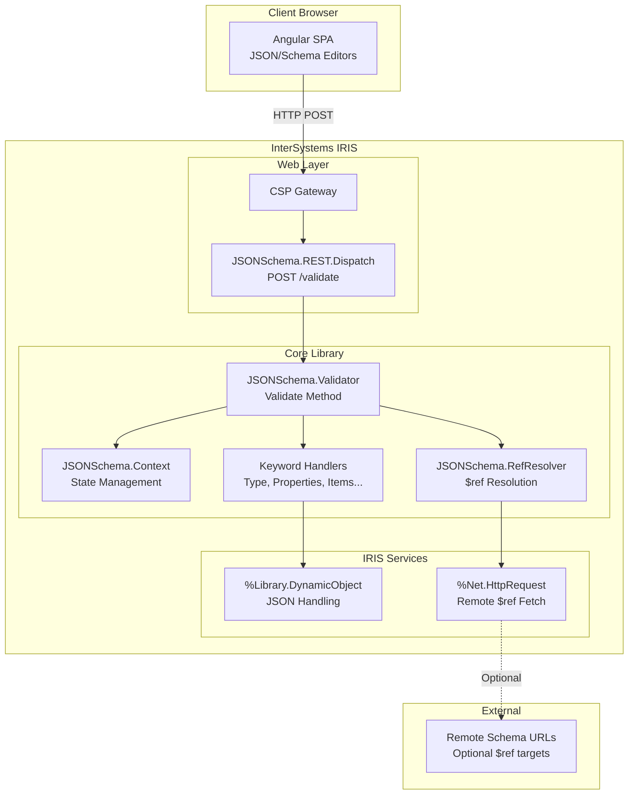
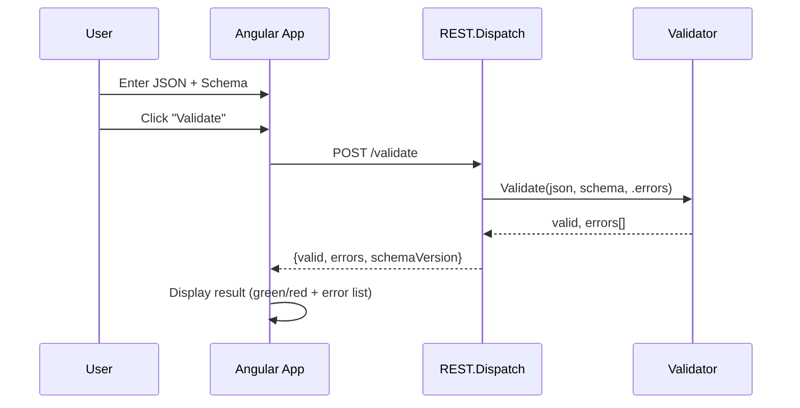

# JSONSchema Validator for InterSystems IRIS
## Fullstack Architecture Document

**Version:** 1.0  
**Date:** December 3, 2025  
**Status:** Complete  

---

## 1. Introduction

This document outlines the complete fullstack architecture for **JSONSchema Validator for InterSystems IRIS**, including the ObjectScript core library, IRIS REST API layer, and Angular web application. It serves as the single source of truth for AI-driven development.

This architecture differs from typical fullstack patterns due to the 100% native ObjectScript requirement - there are no Node.js backends or external language gateways. The IRIS platform provides both the runtime environment and web server capabilities.

**Starter Template:** N/A - Greenfield project

### Change Log

| Date | Version | Description | Author |
|------|---------|-------------|--------|
| 2025-12-03 | 1.0 | Initial architecture document | Architect Agent |

---

## 2. High-Level Architecture

### 2.1 Technical Summary

This architecture implements a **two-tier monolithic design** hosted entirely within InterSystems IRIS:

- **Core Library Tier**: Pure ObjectScript implementation of JSON Schema validation, organized as modular keyword handlers with a central `Validator` class providing the public API. The design prioritizes stateless operation and portable deployment.

- **Presentation Tier**: Angular SPA served as CSP application from IRIS, communicating with IRIS via REST API. The IRIS REST Dispatch class provides the API gateway with built-in JSON serialization.

- **Key Integration Point**: The REST API bridges Angular frontend to ObjectScript backend using `%Library.DynamicObject` for seamless JSON handling. No external services, databases, or caches required - IRIS provides everything.

- **Deployment Model**: Single IPM/ZPM package installs all ObjectScript classes and web application. Angular build artifacts deployed as IRIS CSP application.

### 2.2 Platform and Infrastructure Choice

| Aspect | Decision | Rationale |
|--------|----------|-----------|
| **Platform** | InterSystems IRIS | Target platform per requirements; provides runtime, web server, package management |
| **Web Server** | IRIS Web Gateway / CSP | Native IRIS capability, no additional infrastructure |
| **Static Hosting** | IRIS CSP Application | Bundled with IPM package, no CORS issues |
| **Package Distribution** | IPM/ZPM (Open Exchange) | Standard IRIS package manager, community adoption |

### 2.3 Repository Structure

**Structure:** Monorepo (single repository)  
**Rationale:** Core library and web UI are versioned together; IPM package includes both

```
iris-jsonschema/
├── src/                          # ObjectScript source
│   ├── JSONSchema/               # Core ObjectScript classes
│   │   ├── Validator.cls
│   │   ├── Context.cls
│   │   ├── RefResolver.cls
│   │   └── Keyword/
│   └── Test/JSONSchema/          # %UnitTest classes
├── web/                          # Angular frontend
├── module.xml                    # IPM package definition
├── README.md
├── LICENSE
└── CONTRIBUTING.md
```

### 2.4 High-Level Architecture Diagram



### 2.5 Architectural Patterns

| Pattern | Description | Rationale |
|---------|-------------|-----------|
| **Stateless Validator** | Each `Validate()` call is independent, no persistent state | Simplifies usage, thread-safe, no session management |
| **Strategy Pattern (Keywords)** | Each JSON Schema keyword handled by dedicated class | Extensibility, maintainability, isolated testing |
| **Context Object** | `JSONSchema.Context` carries validation state through recursion | Clean separation of concerns, path tracking |
| **Visitor Pattern** | Recursive traversal of schema and data structures | Natural fit for tree validation, depth control |
| **Facade Pattern** | `Validator.Validate()` as single entry point | Simple API, hides internal complexity |
| **REST Dispatch** | IRIS-native REST routing with automatic JSON handling | No framework dependencies, native performance |

---

## 3. Tech Stack

This is the **definitive technology selection** for the JSONSchema Validator project. All development must use these exact technologies and versions.

| Category | Technology | Version | Purpose | Rationale |
|----------|------------|---------|---------|-----------|
| **Backend Language** | ObjectScript | IRIS 2020.1+ | Core validation library | 100% native requirement, maximum portability |
| **Backend Platform** | InterSystems IRIS | 2020.1+ | Runtime environment | Target platform, provides all services |
| **JSON Handling** | %Library.DynamicObject | Native | JSON parsing and manipulation | Built-in IRIS, high performance |
| **HTTP Client** | %Net.HttpRequest | Native | Remote $ref resolution | Built-in IRIS, no dependencies |
| **REST Framework** | %CSP.REST | Native | REST API dispatch | Native IRIS REST support |
| **Backend Testing** | %UnitTest.TestCase | Native | Unit testing framework | Standard IRIS testing |
| **Frontend Language** | TypeScript | 5.x | Angular development | Type safety, modern JS |
| **Frontend Framework** | Angular | 18.x LTS | Single Page Application | PRD requirement, modern SPA |
| **UI Components** | Angular Material | 18.x | UI component library | Consistent design, accessibility |
| **Code Editor** | Monaco Editor | Latest | JSON/Schema editing | VS Code engine, syntax highlighting |
| **Frontend HTTP** | Angular HttpClient | 18.x | API communication | Built-in Angular, observables |
| **Frontend Testing** | Jasmine + Karma | Latest | Unit testing | Angular default, well-supported |
| **E2E Testing** | Manual (MVP) | - | End-to-end validation | Post-MVP: Playwright or Cypress |
| **CSS Framework** | Angular Material | 18.x | Styling and theming | Integrated with components |
| **Build Tool (FE)** | Angular CLI | 18.x | Frontend builds | Standard Angular tooling |
| **Build Tool (BE)** | IRIS Compiler | Native | ObjectScript compilation | Built-in IRIS |
| **Package Manager** | IPM/ZPM | Latest | IRIS package distribution | Community standard for IRIS |
| **Package Manager (FE)** | npm | 10.x | Frontend dependencies | Node.js standard |
| **Version Control** | Git | Latest | Source control | Industry standard |
| **CI/CD** | GitHub Actions | Latest | Automated builds/tests | Free for open source |
| **Documentation** | Markdown | - | README, docs | Universal, GitHub rendering |

---

## 4. Data Models

This project is a **stateless validation library** - there are no persistent entities or database tables. However, there are critical data structures that must be consistent between the ObjectScript backend and Angular frontend.

### 4.1 ValidationError

**Purpose:** Represents a single validation error with location and context information.

**TypeScript Interface:**
```typescript
interface ValidationError {
  keyword: string;
  dataPath: string;
  schemaPath: string;
  message: string;
}
```

### 4.2 ValidationRequest

**Purpose:** API request payload for validation endpoint.

```typescript
interface ValidationRequest {
  jsonInput: string;
  schemaInput: string;
  schemaVersion?: 'draft-07' | '2020-12';
}
```

### 4.3 ValidationResponse

**Purpose:** API response payload from validation endpoint.

```typescript
interface ValidationResponse {
  valid: boolean;
  errors: ValidationError[];
  schemaVersion: 'draft-07' | '2020-12';
}
```

### 4.4 ValidationContext (Internal)

**Purpose:** Internal state management during validation traversal. Not exposed to API.

```objectscript
Class JSONSchema.Context Extends %RegisteredObject
{
    Property DataPath As %String;
    Property SchemaPath As %String;
    Property Errors As %Library.DynamicArray;
    Property VisitedRefs As %Library.DynamicObject;
    Property Depth As %Integer [ InitialExpression = 0 ];
    Property MaxDepth As %Integer [ InitialExpression = 100 ];
    Property SchemaVersion As %String [ InitialExpression = "draft-07" ];
}
```

---

## 5. API Specification

### REST API (OpenAPI 3.0)

```yaml
openapi: 3.0.3
info:
  title: JSONSchema Validator API
  version: 1.0.0
  description: REST API for validating JSON data against JSON Schema specifications.

servers:
  - url: /api/jsonschema
    description: IRIS CSP Application base path

paths:
  /validate:
    post:
      summary: Validate JSON against Schema
      operationId: validateJSON
      requestBody:
        required: true
        content:
          application/json:
            schema:
              $ref: '#/components/schemas/ValidationRequest'
      responses:
        '200':
          description: Validation completed
          content:
            application/json:
              schema:
                $ref: '#/components/schemas/ValidationResponse'
        '400':
          description: Malformed request
          content:
            application/json:
              schema:
                $ref: '#/components/schemas/ErrorResponse'

components:
  schemas:
    ValidationRequest:
      type: object
      required: [jsonInput, schemaInput]
      properties:
        jsonInput:
          type: string
        schemaInput:
          type: string
        schemaVersion:
          type: string
          enum: ["draft-07", "2020-12"]
          default: "draft-07"

    ValidationResponse:
      type: object
      properties:
        valid:
          type: boolean
        errors:
          type: array
          items:
            $ref: '#/components/schemas/ValidationError'
        schemaVersion:
          type: string

    ValidationError:
      type: object
      properties:
        keyword:
          type: string
        dataPath:
          type: string
        schemaPath:
          type: string
        message:
          type: string

    ErrorResponse:
      type: object
      properties:
        error:
          type: object
          properties:
            code:
              type: string
            message:
              type: string
```

---

## 6. Components

### 6.1 Core ObjectScript Components

#### JSONSchema.Validator (Main Entry Point)

**Responsibility:** Public API for JSON Schema validation. Single entry point for all validation operations.

**Key Interface:**
```objectscript
ClassMethod Validate(pJSON, pSchema, Output pErrors As %DynamicArray, pSchemaVersion As %String = "draft-07") As %Boolean
```

#### JSONSchema.Context (Validation State)

**Responsibility:** Maintains validation state during recursive traversal. Tracks paths, errors, and circular reference protection.

#### JSONSchema.RefResolver ($ref Resolution)

**Responsibility:** Resolves JSON Schema `$ref` references - internal (#/definitions/...) and external (http://...).

#### JSONSchema.Keyword.* (Keyword Handlers)

**Responsibility:** Each class handles validation for a specific JSON Schema keyword (Strategy Pattern).

| Class | Keywords Handled |
|-------|-----------------|
| `JSONSchema.Keyword.Type` | type |
| `JSONSchema.Keyword.Enum` | enum, const |
| `JSONSchema.Keyword.String` | minLength, maxLength, pattern, format |
| `JSONSchema.Keyword.Numeric` | minimum, maximum, exclusiveMinimum, exclusiveMaximum, multipleOf |
| `JSONSchema.Keyword.Object` | properties, required, additionalProperties, patternProperties |
| `JSONSchema.Keyword.Array` | items, additionalItems, minItems, maxItems, uniqueItems, contains |
| `JSONSchema.Keyword.Combinator` | allOf, anyOf, oneOf, not |
| `JSONSchema.Keyword.Conditional` | if, then, else, dependencies |
| `JSONSchema.Keyword.Ref` | $ref |

### 6.2 REST API Component

#### JSONSchema.REST.Dispatch

**Responsibility:** REST endpoint routing and request/response handling.

```objectscript
Class JSONSchema.REST.Dispatch Extends %CSP.REST
{
    Parameter HandleCorsRequest = 1;
    
    XData UrlMap [ XMLNamespace = "http://www.intersystems.com/urlmap" ]
    {
        <Routes>
            <Route Url="/validate" Method="POST" Call="Validate"/>
        </Routes>
    }
}
```

### 6.3 Angular Frontend Components

| Component | Purpose |
|-----------|---------|
| `AppComponent` | Root component, layout |
| `JsonEditorComponent` | Monaco editor for JSON data |
| `SchemaEditorComponent` | Monaco editor for schema |
| `ValidationResultComponent` | Results display |
| `SchemaVersionSelectorComponent` | Version dropdown |
| `ValidationService` | API client service |

---

## 7. Core Workflows

### 7.1 Web UI Validation Flow



### 7.2 Core Validation Flow

The validator processes keywords in priority order:
1. **$ref** - Resolved first, overrides all other keywords
2. **type** - Basic type checking
3. **enum/const** - Value matching
4. **String keywords** - minLength, maxLength, pattern, format
5. **Numeric keywords** - minimum, maximum, multipleOf
6. **Object keywords** - properties, required, additionalProperties
7. **Array keywords** - items, minItems, maxItems, uniqueItems
8. **Combinators** - allOf, anyOf, oneOf, not
9. **Conditionals** - if/then/else, dependencies

---

## 8. Frontend Architecture

### 8.1 Component Organization

```
web/src/app/
├── components/
│   ├── json-editor/
│   ├── schema-editor/
│   ├── validation-result/
│   └── schema-version-selector/
├── services/
│   └── validation.service.ts
├── models/
│   ├── validation-request.model.ts
│   ├── validation-response.model.ts
│   └── validation-error.model.ts
├── app.component.ts
└── app.config.ts
```

### 8.2 State Management

**Approach:** Angular Signals (no external library needed)

```typescript
// State signals
jsonInput = signal<string>(DEFAULT_JSON);
schemaInput = signal<string>(DEFAULT_SCHEMA);
schemaVersion = signal<'draft-07' | '2020-12'>('draft-07');
isValidating = signal<boolean>(false);
validationResult = signal<ValidationResponse | null>(null);

// Computed
hasResult = computed(() => this.validationResult() !== null);
isValid = computed(() => this.validationResult()?.valid ?? false);
```

### 8.3 API Client

```typescript
@Injectable({ providedIn: 'root' })
export class ValidationService {
  private readonly apiUrl = `${environment.apiBaseUrl}/validate`;

  async validate(
    jsonInput: string,
    schemaInput: string,
    schemaVersion: 'draft-07' | '2020-12' = 'draft-07'
  ): Promise<ValidationResponse> {
    return firstValueFrom(
      this.http.post<ValidationResponse>(this.apiUrl, {
        jsonInput,
        schemaInput,
        schemaVersion
      })
    );
  }
}
```

---

## 9. Backend Architecture

### 9.1 Validator Implementation

```objectscript
Class JSONSchema.Validator Extends %RegisteredObject
{

ClassMethod Validate(pJSON, pSchema, Output pErrors As %DynamicArray, pSchemaVersion As %String = "draft-07") As %Boolean
{
    Set tResult = 1
    Set pErrors = ##class(%DynamicArray).%New()
    
    Try {
        Set tData = ..ParseInput(pJSON)
        Set tSchema = ..ParseInput(pSchema)
        Set tContext = ##class(JSONSchema.Context).%New(pSchemaVersion)
        Set tContext.RootSchema = tSchema
        Set tResult = ..ValidateNode(tData, tSchema, tContext)
        Set pErrors = tContext.Errors
        Quit  // Argumentless QUIT in Try block
    }
    Catch ex {
        Set tError = ##class(%DynamicObject).%New()
        Set tError.keyword = "parse"
        Set tError.dataPath = "#"
        Set tError.schemaPath = "#"
        Set tError.message = ex.DisplayString()
        Do pErrors.%Push(tError)
        Set tResult = 0
    }
    Quit tResult
}

}
```

### 9.2 Context Implementation

```objectscript
Class JSONSchema.Context Extends %RegisteredObject
{

Property DataPath As %String [ InitialExpression = "#" ];
Property SchemaPath As %String [ InitialExpression = "#" ];
Property Errors As %DynamicArray;
Property VisitedRefs As %DynamicObject;
Property Depth As %Integer [ InitialExpression = 0 ];
Property MaxDepth As %Integer [ InitialExpression = 100 ];
Property SchemaVersion As %String [ InitialExpression = "draft-07" ];
Property RootSchema As %DynamicObject;

Method %OnNew(pSchemaVersion As %String = "draft-07") As %Status
{
    Set ..Errors = ##class(%DynamicArray).%New()
    Set ..VisitedRefs = ##class(%DynamicObject).%New()
    Set ..SchemaVersion = pSchemaVersion
    Quit $$$OK
}

Method AddError(pKeyword As %String, pMessage As %String)
{
    Set tError = ##class(%DynamicObject).%New()
    Set tError.keyword = pKeyword
    Set tError.dataPath = ..DataPath
    Set tError.schemaPath = ..SchemaPath _ "/" _ pKeyword
    Set tError.message = pMessage
    Do ..Errors.%Push(tError)
}

Method IncrementDepth() As %Boolean
{
    Set ..Depth = ..Depth + 1
    Quit (..Depth <= ..MaxDepth)
}

}
```

---

## 10. Project Structure

```
iris-jsonschema/
├── .github/workflows/           # CI/CD
│   ├── ci.yaml
│   └── release.yaml
├── src/                         # ObjectScript source
│   ├── JSONSchema/
│   │   ├── Validator.cls
│   │   ├── Context.cls
│   │   ├── RefResolver.cls
│   │   ├── REST/
│   │   │   └── Dispatch.cls
│   │   └── Keyword/
│   │       ├── Type.cls
│   │       ├── Enum.cls
│   │       ├── String.cls
│   │       ├── Numeric.cls
│   │       ├── Object.cls
│   │       ├── Array.cls
│   │       ├── Combinator.cls
│   │       ├── Conditional.cls
│   │       └── Ref.cls
│   └── Test/JSONSchema/         # Unit tests
├── web/                         # Angular frontend
│   ├── src/app/
│   ├── angular.json
│   └── package.json
├── csp/jsonschema/              # Built web app
├── docs/                        # Documentation
├── module.xml                   # IPM package
├── README.md
├── LICENSE
└── CONTRIBUTING.md
```

---

## 11. Development Workflow

### Prerequisites

- InterSystems IRIS 2020.1+
- Node.js 20.x LTS
- IPM/ZPM installed
- VS Code with ObjectScript extension

### Development Commands

```bash
# ObjectScript - Load classes
Do $System.OBJ.LoadDir("/path/to/src", "ck", .errors, 1)

# ObjectScript - Run tests
Do ##class(%UnitTest.Manager).RunTest("Test.JSONSchema")

# Angular - Development server
cd web && npm start

# Angular - Production build
cd web && npm run build
```

### Environment Configuration

```typescript
// environment.ts (development)
export const environment = {
  production: false,
  apiBaseUrl: 'http://localhost:52773/api/jsonschema'
};

// environment.prod.ts (production)
export const environment = {
  production: true,
  apiBaseUrl: '/api/jsonschema'
};
```

---

## 12. Deployment Architecture

### Deployment Strategy

- **ObjectScript:** IPM/ZPM package installation
- **Web UI:** IRIS CSP Application (bundled with package)
- **Distribution:** Open Exchange / GitHub releases

### Installation

```objectscript
// Production installation
ZPM "install jsonschema"

// Development - load from local
ZPM "load /path/to/iris-jsonschema"
```

---

## 13. Security & Performance

### Security

| Aspect | Implementation |
|--------|----------------|
| Input Validation | JSON parsing with try/catch |
| CORS | Disabled (same-origin CSP) |
| Authentication | None required (stateless) |
| Remote $ref | Basic HTTP (SSRF protection post-MVP) |

### Performance Targets

| Metric | Target |
|--------|--------|
| Validation (100KB JSON) | < 100ms |
| Deep nesting | Handle 10+ levels |
| Web UI response | < 500ms |
| Bundle size | < 500KB gzipped |

---

## 14. Testing Strategy

### Testing Pyramid

| Level | Framework | Coverage |
|-------|-----------|----------|
| Unit (ObjectScript) | %UnitTest | 90%+ |
| Unit (Angular) | Jasmine/Karma | 80%+ |
| Compliance | JSON Schema Test Suite | 100% required |
| E2E | Manual (MVP) | Critical paths |

### Test Commands

```bash
# ObjectScript
Do ##class(%UnitTest.Manager).RunTest("Test.JSONSchema")

# Angular
cd web && npm test

# JSON Schema Test Suite
Do ##class(%UnitTest.Manager).RunTest("Test.JSONSchema.TestSuite.TestSuiteRunner")
```

---

## 15. Coding Standards

These are **CRITICAL** standards for AI agents. Following these rules prevents common mistakes and ensures consistent, compilable code.

### 15.1 ObjectScript Naming Conventions (REQUIRED)

| Element | Convention | Example |
|---------|------------|---------|
| **Parameters** | `p` prefix | `pSchema`, `pJSON`, `pErrors` |
| **Local Variables** | `t` prefix | `tValid`, `tSchema`, `tContext` |
| **Class Properties** | PascalCase, no prefix | `DataPath`, `Errors`, `MaxDepth` |
| **Class Parameters** | UPPERCASE or PascalCase, NO underscores | `MAXDEPTH`, `MaxDepth` |
| **Access Parameters** | Use `#` character | `..#MAXDEPTH` |
| **Classes/Packages** | PascalCase, match exact case | `JSONSchema.Validator` |

### 15.2 Macro Syntax (CRITICAL)

```objectscript
// ✓ CORRECT: Triple dollar signs ($$$)
Set tSC = $$$OK
If $$$ISERR(tSC) { ... }
Do $$$AssertTrue(condition, "message")
Quit $$$NULLOREF

// ✗ WRONG: Double dollar signs - WILL NOT COMPILE
Set tSC = $$OK     // INCORRECT!
If $$ISERR(tSC)    // INCORRECT!
```

### 15.3 Method Pattern (REQUIRED for void methods)

```objectscript
/// Standard pattern for methods returning %Status
ClassMethod MyMethod(pInput As %String) As %Status
{
    Set tSC = $$$OK
    Try {
        // Logic here
        Set tResult = ..DoSomething(pInput)
        If tResult = "" {
            Set tSC = $$$ERROR($$$GeneralError, "Operation failed")
            Quit  // Argumentless QUIT in Try block
        }
    }
    Catch ex {
        Set tSC = ex.AsStatus()
    }
    Quit tSC  // Return status AFTER Try/Catch
}
```

### 15.4 QUIT Statement Restrictions (CRITICAL)

**ERROR #1043:** QUIT with arguments is NOT allowed within Try/Catch blocks.

```objectscript
// ✗ WRONG: QUIT with argument inside Try/Catch causes ERROR #1043
Method CreateObject() As %DynamicObject
{
    Try {
        Set tObj = ##class(%DynamicObject).%New()
        Quit tObj  // ERROR #1043!
    } Catch ex { }
}

// ✓ CORRECT: Initialize before Try, argumentless QUIT inside, return after
Method CreateObject() As %DynamicObject
{
    Set tResult = ""  // Initialize return variable
    Try {
        Set tResult = ##class(%DynamicObject).%New()
        Quit  // Argumentless QUIT
    }
    Catch ex {
        // Handle error
        Quit  // Argumentless QUIT
    }
    Quit tResult  // Return AFTER Try/Catch
}
```

### 15.5 %DynamicObject Properties with Underscores

```objectscript
// ✓ CORRECT: Quote properties containing underscores
Set tRequest."max_depth" = 100
Set tRequest."schema_version" = "draft-07"

// ✗ WRONG: Underscore is concatenation operator
Set tRequest.max_depth = 100  // This concatenates variables!
```

### 15.6 Command Spacing Rules

```objectscript
// ✓ CORRECT: 1 space after command with arguments
Set tValue = 1
Write tValue

// ✓ CORRECT: 2 spaces after argumentless command
Quit  Do ..Method()  // 2 spaces between Quit and Do

// All commands execute left-to-right on same line
Set x = 1 Set y = 2 Set z = 3  // All execute in order
```

### 15.7 Indentation (CRITICAL)

```objectscript
// ✓ CORRECT: Always indent code inside methods (at least 1 space/tab)
Method MyMethod()
{
    Set x = 1
    If x = 1 {
        Set y = 2
    }
}

// ✗ WRONG: No indentation causes compile errors
Method MyMethod()
{
Set x = 1  // Compile error - no indentation!
}
```

### 15.8 Prohibited Characters

```objectscript
// ✗ WRONG: No '%' or '_' in custom class/property names
Class JSONSchema._Validator  // INVALID
Property _internal As %String  // INVALID
Parameter MAX_DEPTH = 100      // INVALID (underscore in parameter)

// ✓ CORRECT: Use PascalCase or UPPERCASE
Class JSONSchema.Validator
Property Internal As %String
Parameter MAXDEPTH = 100
Parameter MaxDepth = 100
```

### 15.9 Abstract Methods (CRITICAL)

Despite documentation, abstract methods MUST have code blocks with return values:

```objectscript
// ✓ CORRECT: Abstract methods MUST have code blocks with return values
Method ValidateKeyword() As %Boolean [ Abstract ]
{
    Quit 0
}

Method GetHandler() As JSONSchema.Handler [ Abstract ]
{
    Quit $$$NULLOREF
}

Method Process() As %Status [ Abstract ]
{
    Quit $$$OK
}

// ✗ WRONG: Empty abstract method - WILL NOT COMPILE
Method ValidateKeyword() As %Boolean [ Abstract ]
// Missing curly braces and body!
```

### 15.10 Object Handling (CRITICAL)

```objectscript
// ✗ WRONG: $listbuild() serializes objects, losing object identity
Set tList = $listbuild(tObj1, tObj2)  // Objects become strings!
Set tRetrieved = $list(tList, 1)      // <INVALID OREF> error

// ✓ CORRECT: Use individual variables for object storage
Set tObj1 = ##class(MyClass).%New()
Set tObj2 = ##class(MyClass).%New()

// ✓ CORRECT: Use %DynamicArray for object collections
Set tArray = ##class(%DynamicArray).%New()
Do tArray.%Push(tObj1)
Do tArray.%Push(tObj2)
```

### 15.11 Built-in Classes Usage

```objectscript
// ✓ CORRECT: Use IRIS built-in classes
Set tJSON = ##class(%DynamicObject).%New()
Set tArray = ##class(%DynamicArray).%New()
Set tRequest = ##class(%Net.HttpRequest).%New()

// For JSON parsing
Set tData = ##class(%DynamicAbstractObject).%FromJSON(pJSONString)

// For iteration
Set tIter = tObject.%GetIterator()
While tIter.%GetNext(.tKey, .tValue) { }
```

### 15.12 Storage Sections

```objectscript
// IMPORTANT: NEVER manually edit Storage sections
// The IRIS compiler automatically generates and maintains storage
// based on declared properties

// Storage XML is auto-generated - DO NOT MODIFY
```

### 15.13 Documentation (DocBook/HTML)

```objectscript
/// JSONSchema.Validator - Main entry point for JSON Schema validation
/// <p>
/// Provides stateless validation of JSON data against JSON Schema.
/// <p>
/// <b>Supported Versions:</b>
/// <ul>
/// <li>JSON Schema Draft 7</li>
/// <li>JSON Schema 2020-12</li>
/// </ul>
/// <example>
/// Set valid = ##class(JSONSchema.Validator).Validate(data, schema, .errors)
/// </example>
Class JSONSchema.Validator Extends %RegisteredObject
{
```

### 15.14 Angular/TypeScript Conventions

```typescript
// ✓ CORRECT: Use interfaces for API models
interface ValidationError {
  keyword: string;
  dataPath: string;
  schemaPath: string;
  message: string;
}

// ✓ CORRECT: Use signals for state (Angular 18+)
const isValidating = signal<boolean>(false);

// ✓ CORRECT: Async/await for HTTP calls
async validate(): Promise<ValidationResponse> {
  return firstValueFrom(this.http.post<ValidationResponse>(url, body));
}

// ✗ WRONG: Direct process.env access
const apiUrl = process.env.API_URL;  // Use environment.ts instead

// ✓ CORRECT: Environment config
import { environment } from '../environments/environment';
const apiUrl = environment.apiBaseUrl;

// ✓ CORRECT: Standalone components (Angular 18)
@Component({
  selector: 'app-json-editor',
  standalone: true,
  imports: [CommonModule, MonacoEditorModule],
})
```

### 15.15 Project-Specific Critical Rules

| Rule | Description | Why Critical |
|------|-------------|--------------|
| **Stateless Methods** | All Validator methods must be ClassMethods, no instance state | Enables concurrent usage |
| **Error Accumulation** | Never throw exceptions from keyword handlers; add to Context.Errors | Collect all errors, not just first |
| **Path Tracking** | Always Push/Pop paths symmetrically in validation recursion | Accurate error locations |
| **Depth Check First** | Call IncrementDepth() at start of ValidateNode(), DecrementDepth() before all exits | Prevent stack overflow |
| **JSON Type Safety** | Always check $IsObject() before calling %IsA() | Prevent <INVALID OREF> errors |
| **Boolean Returns** | Use 1/0 for validation boolean returns | Consistent API |
| **Context Isolation** | Create new Context for each Validate() call | No cross-request pollution |

### 15.16 Code Quality Validation

**ObjectScript Quality Tools:**
- Use VS Code ObjectScript formatter
- Compile using MCP tool: `compile_objectscript_class` or `compile_objectscript_package`
- Use ObjectScriptQuality tool for automated validation

**Angular Quality Tools:**
- ESLint with Angular rules
- Prettier for formatting
- Run `npm run lint` before commits

---

## 16. Error Handling

### Error Response Format

```typescript
// Validation errors (HTTP 200)
interface ValidationResponse {
  valid: boolean;
  errors: ValidationError[];
  schemaVersion: string;
}

// System errors (HTTP 400/500)
interface ErrorResponse {
  error: {
    code: string;
    message: string;
  };
}
```

### Error Codes

| Code | HTTP Status | Meaning |
|------|-------------|---------|
| `PARSE_ERROR` | 400 | Invalid JSON in request |
| `INVALID_JSON_INPUT` | 400 | jsonInput not valid JSON |
| `INVALID_SCHEMA_INPUT` | 400 | schemaInput not valid JSON |
| `INTERNAL_ERROR` | 500 | Unexpected server error |

---

## 17. Monitoring

### MVP Monitoring

For MVP, monitoring is minimal:

- **IRIS System Logs:** Standard IRIS logging for errors
- **Browser Console:** Frontend errors logged to console
- **Manual Testing:** Verify validation results manually

### Post-MVP Monitoring

- IRIS Performance Metrics
- Application logging to globals
- Frontend error tracking (Sentry or similar)

---

## 18. Checklist Results

**Architecture Checklist Status:** PENDING

The architecture document is complete and ready for validation against the architect checklist.

### Key Architecture Decisions Summary

| Decision | Choice | Rationale |
|----------|--------|-----------|
| Platform | IRIS (no external gateways) | 100% portability requirement |
| Web Deployment | CSP Application | Bundled with IPM, no CORS |
| State Management | Angular Signals | Simple app, no Redux needed |
| API Style | REST (single endpoint) | Simple validation use case |
| Testing | %UnitTest + JSON Schema Test Suite | Compliance verification |

---

## Next Steps

1. **UX Expert:** Create `docs/front-end-spec.md` with detailed UI specification
2. **PO Validation:** Run PO master checklist against architecture
3. **Shard Documents:** Prepare for story creation
4. **Story Drafting:** Begin Epic 1 stories

---

*Document generated via BMad Method - Architect Agent*
