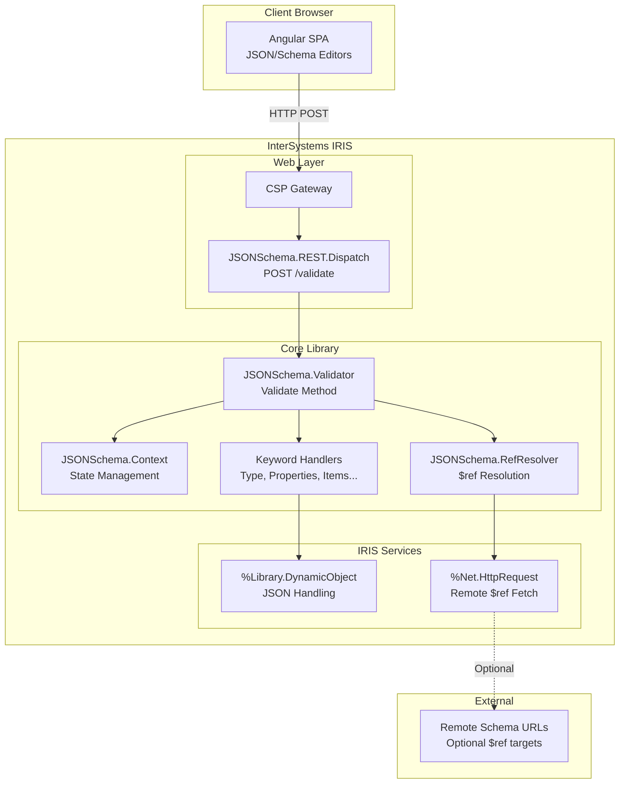

# 2. High-Level Architecture

### 2.1 Technical Summary

This architecture implements a **two-tier monolithic design** hosted entirely within InterSystems IRIS:

- **Core Library Tier**: Pure ObjectScript implementation of JSON Schema validation, organized as modular keyword handlers with a central `Validator` class providing the public API. The design prioritizes stateless operation and portable deployment.

- **Presentation Tier**: Angular SPA served as CSP application from IRIS, communicating with IRIS via REST API. The IRIS REST Dispatch class provides the API gateway with built-in JSON serialization.

- **Key Integration Point**: The REST API bridges Angular frontend to ObjectScript backend using `%Library.DynamicObject` for seamless JSON handling. No external services, databases, or caches required - IRIS provides everything.

- **Deployment Model**: Single IPM/ZPM package installs all ObjectScript classes and web application. Angular build artifacts deployed as IRIS CSP application.

### 2.2 Platform and Infrastructure Choice

| Aspect | Decision | Rationale |
|--------|----------|-----------|
| **Platform** | InterSystems IRIS | Target platform per requirements; provides runtime, web server, package management |
| **Web Server** | IRIS Web Gateway / CSP | Native IRIS capability, no additional infrastructure |
| **Static Hosting** | IRIS CSP Application | Bundled with IPM package, no CORS issues |
| **Package Distribution** | IPM/ZPM (Open Exchange) | Standard IRIS package manager, community adoption |

### 2.3 Repository Structure

**Structure:** Monorepo (single repository)  
**Rationale:** Core library and web UI are versioned together; IPM package includes both

```
iris-jsonschema/
├── src/cls/JSONSchema/           # Core ObjectScript classes
│   ├── Validator.cls
│   ├── Context.cls
│   ├── RefResolver.cls
│   └── Keyword/
├── tests/cls/Test/JSONSchema/    # %UnitTest classes
├── web/                          # Angular frontend
├── module.xml                    # IPM package definition
├── README.md
├── LICENSE
└── CONTRIBUTING.md
```

### 2.4 High-Level Architecture Diagram



### 2.5 Architectural Patterns

| Pattern | Description | Rationale |
|---------|-------------|-----------|
| **Stateless Validator** | Each `Validate()` call is independent, no persistent state | Simplifies usage, thread-safe, no session management |
| **Strategy Pattern (Keywords)** | Each JSON Schema keyword handled by dedicated class | Extensibility, maintainability, isolated testing |
| **Context Object** | `JSONSchema.Context` carries validation state through recursion | Clean separation of concerns, path tracking |
| **Visitor Pattern** | Recursive traversal of schema and data structures | Natural fit for tree validation, depth control |
| **Facade Pattern** | `Validator.Validate()` as single entry point | Simple API, hides internal complexity |
| **REST Dispatch** | IRIS-native REST routing with automatic JSON handling | No framework dependencies, native performance |

---

