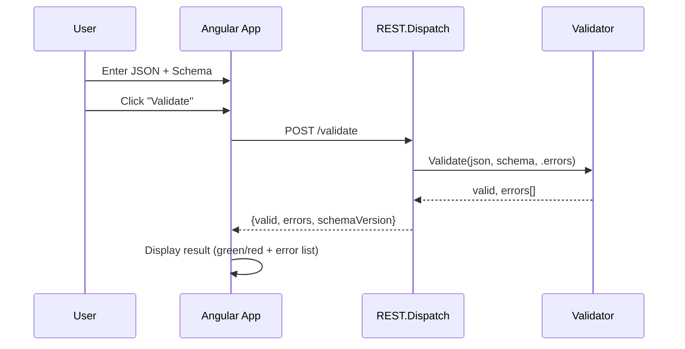

# 7. Core Workflows

### 7.1 Web UI Validation Flow

### 7.2 Core Validation Flow

The validator processes keywords in priority order:
1. **$ref** - Resolved first, overrides all other keywords
2. **type** - Basic type checking
3. **enum/const** - Value matching
4. **String keywords** - minLength, maxLength, pattern, format
5. **Numeric keywords** - minimum, maximum, multipleOf
6. **Object keywords** - properties, required, additionalProperties
7. **Array keywords** - items, minItems, maxItems, uniqueItems
8. **Combinators** - allOf, anyOf, oneOf, not
9. **Conditionals** - if/then/else, dependencies

---

