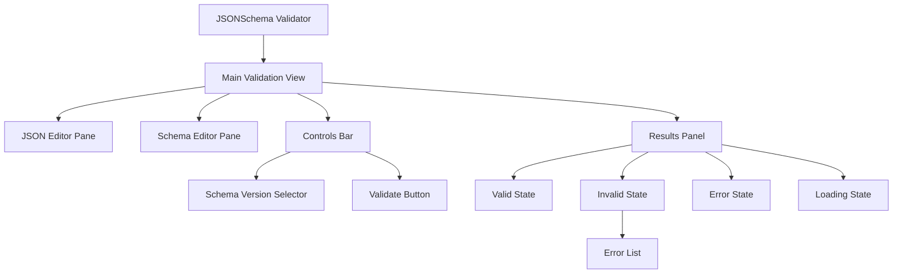
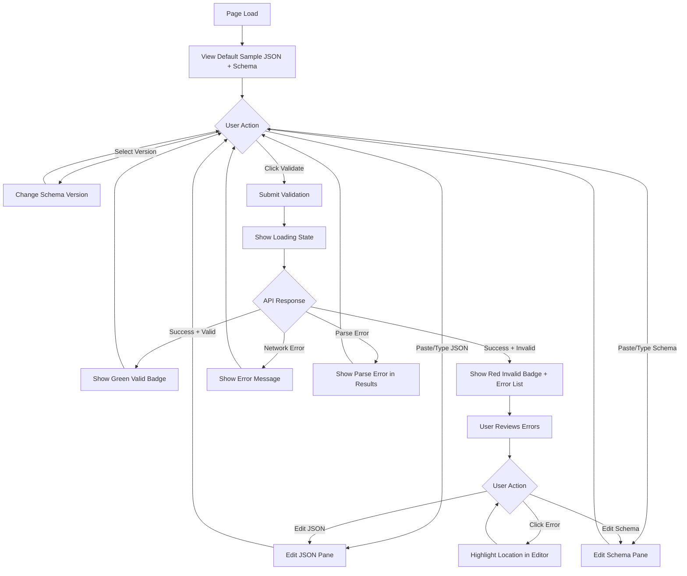
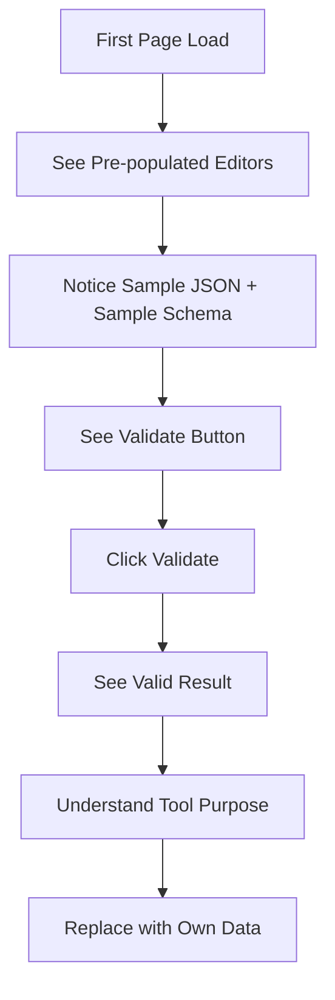

# JSONSchema Validator for InterSystems IRIS
## UI/UX Specification

**Version:** 1.0  
**Date:** December 3, 2025  
**Status:** Complete  

---

## 1. Introduction

This document defines the user experience goals, information architecture, user flows, and visual design specifications for JSONSchema Validator's user interface. It serves as the foundation for visual design and frontend development, ensuring a cohesive and user-centered experience.

### 1.1 Overall UX Goals & Principles

#### Target User Personas

**IRIS Developer (Primary)**
- Technical professionals working with InterSystems IRIS
- Comfortable with JSON and schema concepts
- Need to quickly validate JSON against schemas during development
- Value efficiency and keyboard shortcuts
- May copy/paste from VS Code, Postman, or terminal output

**Integration Developer (Secondary)**
- Building APIs or integrations that consume/produce JSON
- Need to debug why validation fails
- Want clear error messages pointing to exact problems
- May be less familiar with JSON Schema syntax

**QA Engineer (Tertiary)**
- Testing JSON payloads against expected schemas
- Need to verify test data conforms to specifications
- Want batch-like workflow (paste, validate, paste next, validate)

#### Usability Goals

1. **Immediate utility** - User can validate JSON within 30 seconds of page load
2. **Zero learning curve** - Interface self-explanatory, no documentation needed for basic use
3. **Error clarity** - Validation errors immediately understandable with exact locations
4. **Efficient iteration** - Edit and re-validate without friction
5. **Copy-paste optimized** - Large JSON payloads paste without lag or truncation

#### Design Principles

1. **Function over form** - Developer tool aesthetics; clean but not flashy
2. **Visibility** - Both inputs and outputs visible simultaneously without scrolling
3. **Immediate feedback** - Validation results appear instantly after click
4. **Non-destructive** - Never lose user input; errors don't clear editors
5. **Keyboard accessible** - Power users can work without mouse

### 1.2 Change Log

| Date | Version | Description | Author |
|------|---------|-------------|--------|
| 2025-12-03 | 1.0 | Initial UI/UX specification | UX Expert Agent |

---

## 2. Information Architecture (IA)

### 2.1 Site Map / Screen Inventory

This is a **single-page application** with one primary view and contextual states:



### 2.2 Navigation Structure

**Primary Navigation:** None required - single page application

**Secondary Navigation:** None required

**Breadcrumb Strategy:** Not applicable

**In-Page Navigation:**
- Tab key cycles through: JSON Editor → Schema Editor → Version Selector → Validate Button
- Error list items are focusable for keyboard navigation

---

## 3. User Flows

### 3.1 Primary Flow: Validate JSON Against Schema

**User Goal:** Validate a JSON document against a JSON Schema and identify any validation errors

**Entry Points:** 
- Direct URL access to application
- Bookmark or link from documentation

**Success Criteria:**
- User sees clear "Valid" or "Invalid" status
- If invalid, user can identify exact location and nature of each error
- User can iterate (edit and re-validate) efficiently

#### Flow Diagram



#### Edge Cases & Error Handling

- **Malformed JSON in editor:** Show inline error indicator in Monaco, disable validate button with tooltip "Fix JSON syntax errors first"
- **Malformed Schema in editor:** Show inline error indicator, disable validate button with tooltip "Fix Schema syntax errors first"
- **Empty JSON field:** Show placeholder prompt, disable validate
- **Empty Schema field:** Show placeholder prompt, disable validate
- **Network timeout:** Show "Connection error - please try again" with retry button
- **Very large JSON (>1MB):** Show warning but allow validation; may be slow
- **API returns 500:** Show "Server error - please try again later"

**Notes:** The validation button should provide immediate visual feedback (loading state) to confirm the click was registered, especially important for larger documents.

### 3.2 Secondary Flow: First-Time User Experience

**User Goal:** Understand what the tool does and how to use it

**Entry Points:** First visit to application

**Success Criteria:** User successfully completes their first validation within 60 seconds

#### Flow Diagram



**Notes:** Default sample data serves as implicit tutorial. Sample should be simple but demonstrate key schema features (type, properties, required).

---

## 4. Wireframes & Mockups

### 4.1 Design Files

**Primary Design Files:** ASCII wireframes provided below (no external design tool for MVP)

### 4.2 Key Screen Layouts

#### Main Validation View (Desktop - Default State)

```
┌──────────────────────────────────────────────────────────────────────────────┐
│  JSONSchema Validator                          [Draft 7 ▼] [  Validate  ]    │
├──────────────────────────────────┬───────────────────────────────────────────┤
│  JSON Data                       │  JSON Schema                              │
│  ─────────────────────────────   │  ─────────────────────────────            │
│  1 │ {                           │  1 │ {                                    │
│  2 │   "name": "John Doe",       │  2 │   "type": "object",                  │
│  3 │   "age": 30,                │  3 │   "properties": {                    │
│  4 │   "email": "john@ex.com"    │  4 │     "name": { "type": "string" },    │
│  5 │ }                           │  5 │     "age": { "type": "integer" },    │
│    │                             │  6 │     "email": { "type": "string" }    │
│    │                             │  7 │   },                                 │
│    │                             │  8 │   "required": ["name", "email"]      │
│    │                             │  9 │ }                                    │
│    │                             │    │                                      │
├──────────────────────────────────┴───────────────────────────────────────────┤
│  Results                                                                      │
│  ─────────────────────────────────────────────────────────────────────────   │
│  [Ready to validate - click Validate button or press Ctrl+Enter]             │
│                                                                               │
└──────────────────────────────────────────────────────────────────────────────┘
```

**Purpose:** Primary working view for validation

**Key Elements:**
- Header bar with title, version selector, and validate button
- Split-pane editors (50/50 default, resizable)
- Results panel below editors
- Monaco editors with line numbers and syntax highlighting

**Interaction Notes:**
- Pane divider is draggable to resize
- Ctrl+Enter triggers validation from anywhere
- Tab navigates between major sections

#### Valid State

```
├──────────────────────────────────┴───────────────────────────────────────────┤
│  Results                                                                      │
│  ─────────────────────────────────────────────────────────────────────────   │
│  ┌─────────────────────────────────────────────────────────────────────────┐ │
│  │  ✓ Valid                                                                │ │
│  │    JSON data conforms to schema (Draft 7)                               │ │
│  └─────────────────────────────────────────────────────────────────────────┘ │
└──────────────────────────────────────────────────────────────────────────────┘
```

**Purpose:** Confirm successful validation

**Key Elements:**
- Green checkmark icon
- "Valid" text prominently displayed
- Subtle confirmation message with schema version used

#### Invalid State with Errors

```
├──────────────────────────────────┴───────────────────────────────────────────┤
│  Results                                                                      │
│  ─────────────────────────────────────────────────────────────────────────   │
│  ┌─────────────────────────────────────────────────────────────────────────┐ │
│  │  ✗ Invalid (3 errors)                                                   │ │
│  └─────────────────────────────────────────────────────────────────────────┘ │
│                                                                               │
│  │ Path          │ Keyword  │ Message                                      │ │
│  ├───────────────┼──────────┼──────────────────────────────────────────────┤ │
│  │ #/age         │ type     │ Expected integer but got string              │ │
│  │ #/email       │ required │ Required property 'email' is missing         │ │
│  │ #/tags/0      │ type     │ Expected string but got number               │ │
│                                                                               │
└──────────────────────────────────────────────────────────────────────────────┘
```

**Purpose:** Display validation errors clearly

**Key Elements:**
- Red X icon with error count
- Table with Path, Keyword, Message columns
- Rows are clickable to highlight in editor
- Scrollable if many errors

**Interaction Notes:**
- Click row to scroll JSON editor to error location
- Hover shows full message if truncated
- Path uses JSON Pointer notation (#/path/to/property)

#### Loading State

```
├──────────────────────────────────┴───────────────────────────────────────────┤
│  Results                                                                      │
│  ─────────────────────────────────────────────────────────────────────────   │
│  ┌─────────────────────────────────────────────────────────────────────────┐ │
│  │  ◐ Validating...                                                        │ │
│  └─────────────────────────────────────────────────────────────────────────┘ │
└──────────────────────────────────────────────────────────────────────────────┘
```

**Purpose:** Indicate validation in progress

**Key Elements:**
- Animated spinner icon
- "Validating..." text
- Validate button disabled during request

#### Error State (System Error)

```
├──────────────────────────────────┴───────────────────────────────────────────┤
│  Results                                                                      │
│  ─────────────────────────────────────────────────────────────────────────   │
│  ┌─────────────────────────────────────────────────────────────────────────┐ │
│  │  ⚠ Error                                                                │ │
│  │    Could not connect to validation server. Please try again.            │ │
│  │                                                    [ Retry ]            │ │
│  └─────────────────────────────────────────────────────────────────────────┘ │
└──────────────────────────────────────────────────────────────────────────────┘
```

**Purpose:** Handle network/server errors gracefully

**Key Elements:**
- Warning icon (yellow/orange)
- User-friendly error message
- Retry button

---

## 5. Component Library / Design System

### 5.1 Design System Approach

**Approach:** Angular Material 18 with custom theme

Angular Material provides accessible, well-tested components out of the box. We'll use a minimal subset with a custom developer-tool theme.

### 5.2 Core Components

#### MonacoEditorComponent

**Purpose:** Code editor for JSON and Schema input

**Variants:**
- JSON mode (left pane)
- JSON Schema mode (right pane)

**States:**
- Default (editable)
- Error (syntax error highlighting)
- Read-only (future: for displaying formatted output)

**Usage Guidelines:**
- Always show line numbers
- Enable JSON language mode
- Enable bracket matching
- Minimap disabled (saves space)
- Word wrap enabled

#### ValidationResultComponent

**Purpose:** Display validation outcome and errors

**Variants:**
- Ready state (awaiting validation)
- Loading state (validation in progress)
- Valid state (green success)
- Invalid state (red with error table)
- Error state (yellow/orange system error)

**States:**
- Collapsed (just status badge)
- Expanded (full error list) - default when errors exist

**Usage Guidelines:**
- Always visible below editors
- Minimum height to prevent layout shift
- Scrollable for long error lists

#### SchemaVersionSelectorComponent

**Purpose:** Select JSON Schema version for validation

**Variants:** N/A (single dropdown)

**States:**
- Default (Draft 7 selected)
- Open (showing options)
- Focused (keyboard navigation)

**Usage Guidelines:**
- Options: "Draft 7" (default), "2020-12"
- Compact display in header bar
- Accessible via keyboard

#### ValidateButtonComponent

**Purpose:** Trigger validation action

**Variants:**
- Primary action button (filled)

**States:**
- Default (enabled, ready)
- Hover
- Active/Pressed
- Disabled (when editors have syntax errors)
- Loading (during validation)

**Usage Guidelines:**
- Prominent placement in header
- Shows spinner during validation
- Disabled with tooltip when JSON/Schema invalid

#### ErrorListComponent

**Purpose:** Display validation errors in tabular format

**Variants:** N/A

**States:**
- Empty (hidden)
- Populated (showing errors)
- Row hover (highlight row)
- Row selected (after click)

**Usage Guidelines:**
- Three columns: Path, Keyword, Message
- Rows clickable to navigate to error
- Sortable by path (optional, post-MVP)

---

## 6. Branding & Style Guide

### 6.1 Visual Identity

**Brand Guidelines:** Developer tool aesthetic - clean, professional, functional

No elaborate branding required. Focus on usability and clarity.

### 6.2 Color Palette

| Color Type | Hex Code | Usage |
|------------|----------|-------|
| Primary | `#1976D2` | Validate button, links, focus states |
| Secondary | `#424242` | Headers, secondary text |
| Accent | `#00BCD4` | Schema version selector highlight |
| Success | `#4CAF50` | Valid status badge, checkmark |
| Warning | `#FF9800` | System warnings, notices |
| Error | `#F44336` | Invalid status badge, error text |
| Neutral-100 | `#FAFAFA` | Editor background |
| Neutral-200 | `#EEEEEE` | Panel borders, dividers |
| Neutral-700 | `#616161` | Secondary text |
| Neutral-900 | `#212121` | Primary text |

### 6.3 Typography

#### Font Families

- **Primary:** `Roboto, -apple-system, BlinkMacSystemFont, sans-serif`
- **Monospace:** `'Fira Code', 'JetBrains Mono', 'Consolas', monospace`

Monospace used for: Editors, JSON paths in error list, code snippets

#### Type Scale

| Element | Size | Weight | Line Height |
|---------|------|--------|-------------|
| H1 (Title) | 24px | 500 | 32px |
| H2 (Panel Headers) | 16px | 500 | 24px |
| Body | 14px | 400 | 20px |
| Small | 12px | 400 | 16px |
| Code | 13px | 400 | 18px |

### 6.4 Iconography

**Icon Library:** Material Icons (via Angular Material)

**Usage Guidelines:**
- Use outlined variant for consistency
- 24px standard size for buttons
- 18px for inline icons
- Always include aria-label for accessibility

**Key Icons:**
- `check_circle` - Valid state
- `cancel` - Invalid state
- `warning` - System error
- `sync` - Loading/spinner
- `keyboard_arrow_down` - Dropdown indicator

### 6.5 Spacing & Layout

**Grid System:** CSS Grid for main layout, Flexbox for components

**Spacing Scale:** 4px base unit
- `xs`: 4px
- `sm`: 8px
- `md`: 16px
- `lg`: 24px
- `xl`: 32px

**Layout Specifications:**
- Header height: 56px
- Editor panes: Fill available height (min 300px)
- Results panel: 150px minimum, expandable
- Gutter between panes: 8px (draggable)
- Content padding: 16px

---

## 7. Accessibility Requirements

### 7.1 Compliance Target

**Standard:** WCAG 2.1 Level AA

### 7.2 Key Requirements

**Visual:**
- Color contrast ratios: Minimum 4.5:1 for normal text, 3:1 for large text
- Focus indicators: Visible 2px outline on all interactive elements
- Text sizing: Supports browser zoom up to 200% without horizontal scroll

**Interaction:**
- Keyboard navigation: All functions accessible via keyboard
- Screen reader support: ARIA labels on all interactive elements
- Touch targets: Minimum 44x44px for mobile

**Content:**
- Alternative text: Icons have aria-labels
- Heading structure: Logical heading hierarchy (h1 → h2 → h3)
- Form labels: All inputs have associated labels

### 7.3 Specific Accessibility Features

| Feature | Implementation |
|---------|----------------|
| Skip to content | Link to skip header and go to JSON editor |
| Editor accessibility | Monaco has built-in screen reader support |
| Status announcements | ARIA live region for validation results |
| Error navigation | Errors announced, clickable to navigate |
| High contrast mode | Respects system preference |
| Reduced motion | Respects `prefers-reduced-motion` |

### 7.4 Testing Strategy

- Manual testing with VoiceOver (macOS) and NVDA (Windows)
- Automated testing with axe-core
- Keyboard-only navigation testing
- Color contrast verification with browser dev tools

---

## 8. Responsiveness Strategy

### 8.1 Breakpoints

| Breakpoint | Min Width | Max Width | Target Devices |
|------------|-----------|-----------|----------------|
| Mobile | 0px | 599px | Phones (limited support) |
| Tablet | 600px | 1023px | Tablets, small laptops |
| Desktop | 1024px | 1439px | Laptops, monitors |
| Wide | 1440px | - | Large monitors |

### 8.2 Adaptation Patterns

**Layout Changes:**
- Desktop/Wide: Side-by-side editor panes
- Tablet: Side-by-side with reduced padding
- Mobile: Stacked panes (JSON above Schema)

**Navigation Changes:**
- All breakpoints: Controls in header
- Mobile: Validate button full width below editors

**Content Priority:**
- Primary: JSON and Schema editors
- Secondary: Validation results
- Tertiary: Schema version selector

**Interaction Changes:**
- Desktop: Draggable pane divider
- Mobile: Fixed 50/50 split or tabbed interface

**Mobile Note:** Mobile is not the primary target. Basic functionality should work, but the tool is optimized for desktop development use.

---

## 9. Animation & Micro-interactions

### 9.1 Motion Principles

1. **Purposeful** - Animation serves function, not decoration
2. **Quick** - Animations under 300ms, usually 150-200ms
3. **Subtle** - Enhance, don't distract
4. **Respectful** - Honor `prefers-reduced-motion`

### 9.2 Key Animations

| Animation | Description | Duration | Easing |
|-----------|-------------|----------|--------|
| Button press | Slight scale down on click | 100ms | ease-out |
| Loading spinner | Rotating circle | 1000ms loop | linear |
| Result fade-in | Results panel content fade | 200ms | ease-in |
| Error highlight | Flash background on error row click | 300ms | ease-in-out |
| Pane resize | Smooth width transition while dragging | 0ms (real-time) | - |
| Tooltip appear | Fade in on hover | 150ms | ease-out |

---

## 10. Performance Considerations

### 10.1 Performance Goals

| Metric | Target |
|--------|--------|
| Initial Page Load | < 2 seconds (First Contentful Paint) |
| Time to Interactive | < 3 seconds |
| Validation Response | < 500ms (including network) |
| Editor Responsiveness | No lag typing at 60+ WPM |
| Animation FPS | 60fps for all animations |

### 10.2 Design Strategies

**Code Splitting:**
- Monaco Editor loaded asynchronously
- Core app loads first, editor initializes after

**Asset Optimization:**
- Tree-shake unused Angular Material components
- Preconnect to API endpoint
- Minimal custom CSS

**Runtime Performance:**
- Debounce syntax validation in editors (300ms)
- Virtual scrolling for large error lists (if >100 errors)
- Avoid layout thrashing during resize

**Bundle Size Targets:**
- Main bundle: < 150KB gzipped
- Monaco chunk: < 300KB gzipped (lazy loaded)
- Total: < 500KB gzipped

---

## 11. Default Sample Content

### 11.1 Default JSON Data

```json
{
  "name": "John Doe",
  "age": 30,
  "email": "john.doe@example.com",
  "address": {
    "street": "123 Main St",
    "city": "Springfield",
    "zipCode": "12345"
  },
  "tags": ["developer", "iris"]
}
```

### 11.2 Default JSON Schema

```json
{
  "$schema": "http://json-schema.org/draft-07/schema#",
  "type": "object",
  "properties": {
    "name": {
      "type": "string",
      "minLength": 1
    },
    "age": {
      "type": "integer",
      "minimum": 0
    },
    "email": {
      "type": "string",
      "format": "email"
    },
    "address": {
      "type": "object",
      "properties": {
        "street": { "type": "string" },
        "city": { "type": "string" },
        "zipCode": { "type": "string" }
      },
      "required": ["street", "city"]
    },
    "tags": {
      "type": "array",
      "items": { "type": "string" }
    }
  },
  "required": ["name", "email"]
}
```

**Rationale:** Sample demonstrates:
- Multiple data types (string, integer, array, object)
- Nested objects
- Required properties
- Format validation
- Array items validation

---

## 12. Next Steps

### 12.1 Immediate Actions

1. Review this specification with stakeholders
2. Set up Angular 18 project structure per architecture.md
3. Integrate Monaco Editor component
4. Implement core layout (header, split panes, results)
5. Create ValidationService for API communication
6. Implement state management with Angular Signals
7. Style with Angular Material theme

### 12.2 Design Handoff Checklist

- [x] All user flows documented
- [x] Component inventory complete
- [x] Accessibility requirements defined
- [x] Responsive strategy clear
- [x] Brand guidelines incorporated
- [x] Performance goals established
- [x] Default content specified
- [x] Error states defined

---

## 13. Checklist Results

### UI/UX Specification Completeness

| Section | Status | Notes |
|---------|--------|-------|
| Introduction & Goals | ✅ Complete | Personas, usability goals, design principles defined |
| Information Architecture | ✅ Complete | Single-page app, simple IA |
| User Flows | ✅ Complete | Primary validation flow + first-time UX |
| Wireframes | ✅ Complete | ASCII wireframes for all states |
| Component Library | ✅ Complete | Core components identified |
| Branding & Style | ✅ Complete | Colors, typography, icons defined |
| Accessibility | ✅ Complete | WCAG AA target, specific requirements |
| Responsiveness | ✅ Complete | Desktop-first with mobile support |
| Animation | ✅ Complete | Minimal, purposeful animations |
| Performance | ✅ Complete | Goals and strategies defined |

**Overall Status:** ✅ COMPLETE - Ready for development

---

*Document generated via BMad Method - UX Expert Agent*
